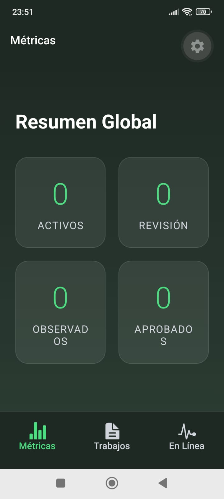
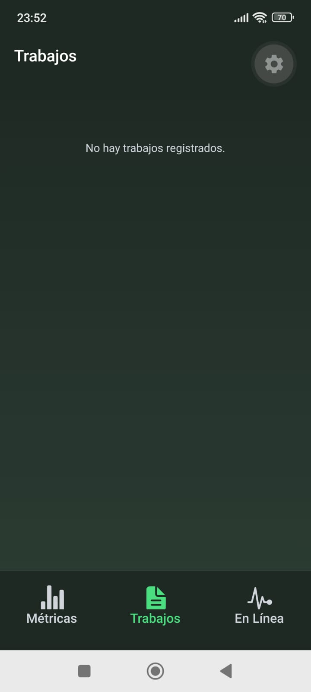
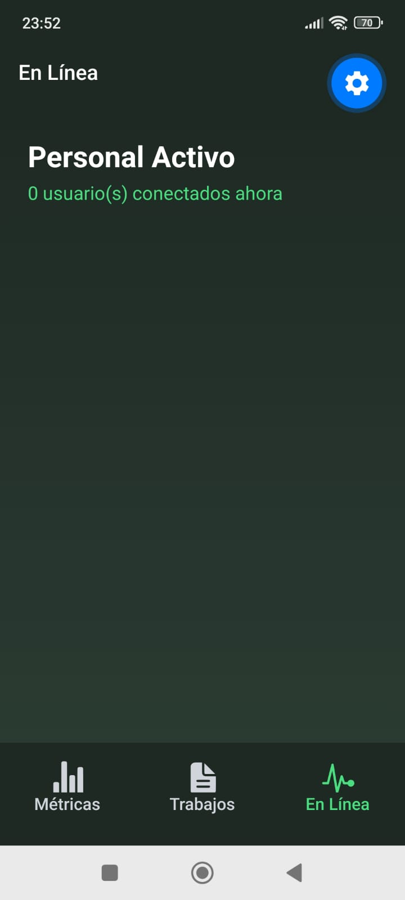

# DataReport IASA - Mobile App 🌿

Aplicación móvil de monitoreo institucional. Permite la visualización de métricas en tiempo real, seguimiento de informes y monitoreo de personal activo.

## Capturas de Pantalla

<div align="center">
  <!-- Reemplaza las rutas de las imágenes arrastrando tus capturas a la interfaz de GitHub -->
  
  
  
</div>

## Tecnologías Principales

*   **Frontend:** React Native + Expo Router
*   **Estado Global:** Zustand + Expo Secure Store (Persistencia de JWT)
*   **Peticiones HTTP:** Axios (con interceptores automáticos de tokens)
*   **Tiempo Real:** Supabase Realtime (WebSockets para presencia de usuarios)
*   **UI/UX:** Expo Linear Gradient + Ionicons

## Arquitectura y Backend

Esta aplicación es el cliente móvil de una arquitectura distribuida. Consume una API RESTful construida con **Hono.js** y desplegada en **Cloudflare Workers**, utilizando **PostgreSQL (Supabase)** como motor de base de datos principal.

Debido a que el backend maneja roles estrictos (RBAC) y la base de datos requiere variables de entorno privadas, este repositorio contiene únicamente el código del cliente.

## Instalación y Ejecución Local

Inicia el servidor de Expo:

``` Bash
pnpm exec expo start -c
```

> .[!NOTA]
> El proyecto no funcionará por la falta de credenciales en las variables de entorno, pero con las capturas se asegura que el proyecto funciona, al menos para esta version inicial.